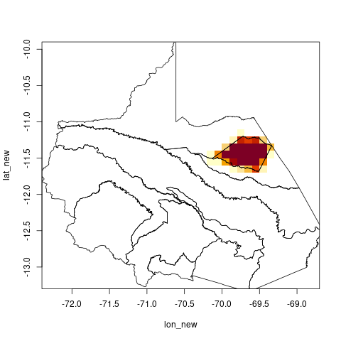

# polilla

This little package takes gridded coordinates (points), creates a grid based on
polygons, and identifies all the grids cells that intersects a polygon (like
a district). In addition, it calculates the weights of each grid cell based on
how much they intersect the polygon. This last capability is useful to
calculate weighted statistics or to create a mask.

## Installation

You can install the package with:

```r
devtools::install_github("profesorpaiche/polilla")
```

## How to use

This is an example that uses all the functions in this package. First, let's load the necessary packages and datasets.

```r
library(dplyr)
library(sf)
library(ggplot2)
library(polilla)

data(shp)
data(gridlon)
data(gridlat)
```

**A quick note on the data:** The grid coordinates corresponds to the area
around Germany, while the polygon is the city of Hamburg. Both dataset are in
a very especial type of projection. This is because the coordinates comes from
the EURO-CORDEX datasets. To keep everything running smoothly, we need to
define this especial projection.

```r
crs_ortho ="+proj=ortho +lat_0=50.75 +lon_0=18"
```

Now, we can convert the coordinate points to a simple feature object (`sf`) and
assign the special projection. The polygon for Hamburg is already in this
projection.

```r
lonlat_sf = sfCoords(lon = gridlon, lat = gridlat, crs = 4326) |>
    st_transform(crs = crs_ortho)
```

Since the area covered by the grid points (Germany) is much bigger than the
polygon (Hamburg), we can reduce the amount of points by selecting the grids
around the polygon.

```r
lonlat_sf = extraCrop(lonlat_sf, shp)
```

And then we can create the grid as polygons where the centroids are the
original coordinate points. From this grid, we can interpolate it with the
polygon of Hamburg and calculate the area-based weights for each grid cell.

```r
grid_poly = gridMaker(lonlat_sf, crs = crs_ortho)
intersection = getWeights(grid_poly, shp)
grid_poly = left_join(grid_poly, intersection, by = "id")
```

We can see the grid cells, their weights, and centroids with the following code. 

```r
g = ggplot() +
    geom_sf(data = grid_poly, mapping = aes(fill = weights)) +
    geom_sf(data = shp, fill = NA) +
    geom_sf(data = grid_poly |> st_centroid(), color = "royalblue") +
    geom_sf(data = lonlat_sf, color = "brown")
```



Here, the centroids are plotted as the actual centroid for each grid cell
(blue) and the original coordinates (red). You might not see the blue dots
since the red ones are on top of it, which is good. This should always happens
if you have a equally-spaced grid. Otherwise, you will see a small displacement
of the points. Actually, this example corresponds to the second case. Due to
the very especial projection of the data, the points are a bit out of phase,
just happens that we select a relative small area and the error is not
noticeable. If you try to create the grids for whole Germany, you will see what
I am talking about. Git it a try!

## Alternatives

You can get the same benefits (and more) if you use more mature packages like
[exactextractr](https://isciences.gitlab.io/exactextractr/index.html) or
[stars](https://r-spatial.github.io/stars/).

Originally, I created `polilla` because I wasn't aware of any packages that
could do the weight calculations. Perhaps one benefit of `polilla` is that
requires less dependencies (only `sf` and `dplyr`), so it is easier to install
if you don't have superuser benefits to install a bunch of other dependencies.
